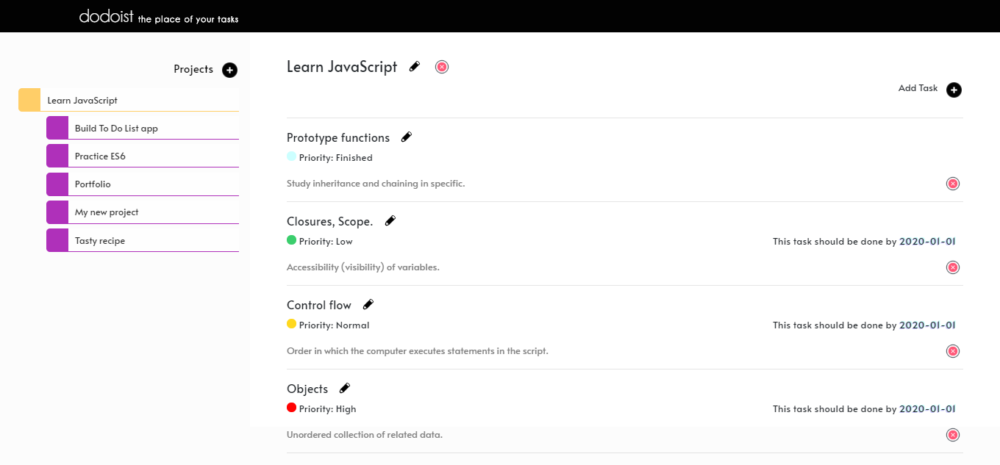

# dodoist

## Table of Contents

* [About the Project](#about-the-project)
  * [Built With](#built-with)
* [Contact](#contact)
* [Acknowledgements](#acknowledgements)

<!-- ABOUT THE PROJECT -->
## About The Project

Our JavaScript to-do list application, named dodoist, is simple and clean, you can create new projects and store, (using localStorage), tasks inside every project.
All the tasks have the following properties:
*   Title
*   Priority
*   Due date
*   Description

You can select a project and see all it's tasks.

Link for project specifications: [Odin-Project](https://www.theodinproject.com/courses/javascript/lessons/todo-list)

### Built With

*   SCSS - Style
*   Bootstrap4 - Positioning
*   JavaScript - Behaviour and Structure

<!-- CONTACT -->
## Contact

Guadalupe Rangel - kanemekanik@gmail.com

Mario Dena - mario_dena@outlook.com

<!-- ACKNOWLEDGEMENTS -->
## Acknowledgements

* [Microverse](https://www.microverse.org/)
